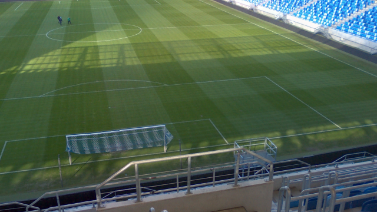
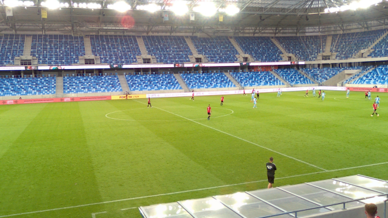

# Calib360 Official Repository

This is the official repository of the Calib360 dataset. It contains the
source code of the labeling tool, as well as the exported training and validation
sets used in our paper - Football Playing Field Registration Using Distance Maps

Download the annotated dataset from:

| Item | Size |
|--|--|
| [calib360-annotated.tar.gz](https://vggnas.fiit.stuba.sk/download/datasets/calib360/calib360-annotated.tar.gz) | 1.9 GB |

Extract the archive into your home folder, so that labeling tool can find the archive content in `~/.Playfield`.


The exported dataset is stored in a Squash-FS archive:

| Item | Size |
|--|--|
| [calib360.sqsh](https://vggnas.fiit.stuba.sk/download/datasets/calib360/calib360.sqsh) | 106 GB |
| [calib360.md5](https://vggnas.fiit.stuba.sk/download/datasets/calib360/calib360.md5) | 48 bytes |

The source panoramas were used from our other dataset - [Football360](https://github.com/IgorJanos/stuFootball360)


## Example images


| Image 0 | Image 12000 | Image 19000 |
|---------|-------------|-------------|
|  |  |  |


## Labeling Tool

The labeling tool makes it possible to annotate equirectangular panoramic images
with the positions of playing field keypoints.


Once the panoramic images are properly annotated, the camera orientation and field of view
can be adjusted, and accurate ground truth camera parameters can be computed.


## Citing Calib360

If you find Calib360 useful in your research, please consider citing:

```
TODO:
```